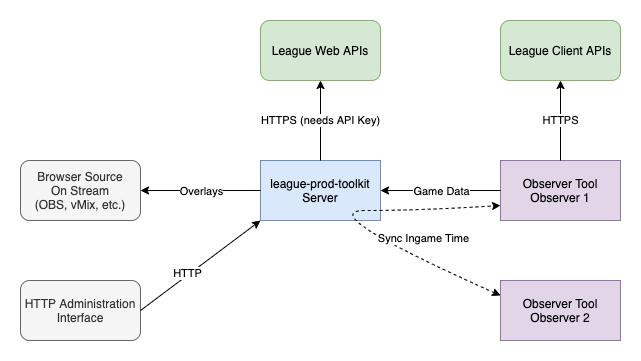

# league-prod-toolkit

## What's the state of this?
This is currently under heavy development and **cannot be used right now**.

## What is this?
This is a modular software, that aims to assist in professional league of legends productions. It is built with modularity in mind,
so it should allow to be adapted to your individual needs.

## Architecture
Please note that this composition of modules is only an example of how it could be used. Every module can be disabled / turned off. There may also be more modules available than shown here.



Legend:
- Magenta - this application runs externally and connects to the server via websocket
- Blue - this application runs within the server process
- Green - this is an external API that is being connected to
- Grey - this is something that is visible or where user interaction happens

## Developing
This section contains information about how to locally run and extend the toolkit.

### Building modules
To make sure all the modules are correctly built and installed, use the following command:

```
npm run build:modules
```

This will make sure that all modules are installed and built correctly. If you want to only run for a single module, have a look at the folder name of the module, and then run:

```
npm run build:modules static-league
```

### Setting up git hooks
In order to set up a git pre-commit hook, that will make sure that the code style conforms to the guideline before you commit, run:

```
npm run setuphooks
```
